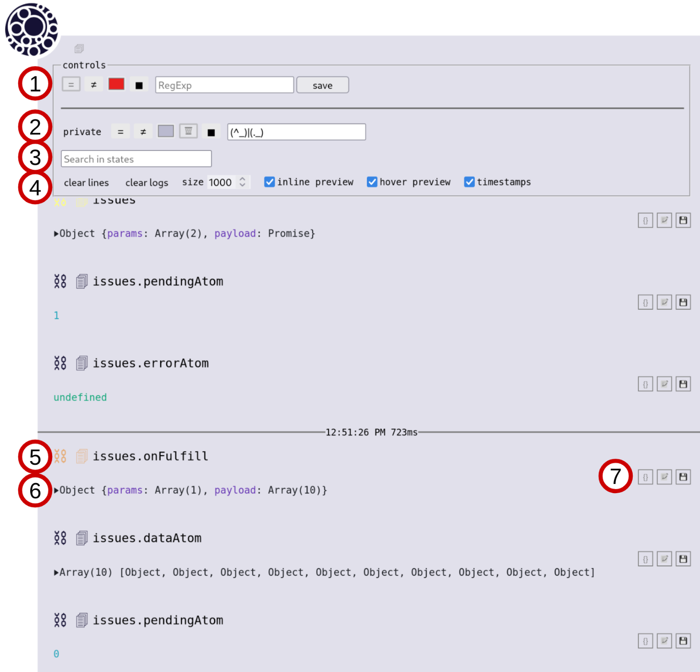

This devtools is NOT coupled to Reatom and may be worked as a general logger for any kind of data. For Reatom users it has some additional features like actions and states cause tracing. But by default it has a huge list of features to log, highlight, filter and inspect any kind of logs.

## Installation

```sh
npm install @reatom/devtools
```

**Note** that this package is published with ESM bundle only.

## Setup

Typical setup in your root file may look like that.

```ts
declare global {
  var DEVTOOLS: null | Devtools
}
if (import.meta.env.DEV) {
  const { createDevtools } = await import('@reatom/devtools')
  globalThis.DEVTOOLS = createDevtools()
} else {
  globalThis.DEVTOOLS = null
}
```

It is recommended to put the devtools to the global scope to log and inspect needed data easily during development or debugging.

**IMPORTANT NOTE** **for Reatom users** - put your `ctx` as an option to the create function (`createDevtools({ ctx })`).

## Devtools API

`createDevtools` returns an object with a few methods:

- `log(name: string, payload?: any)` - log any kind of data
- `state<T>(name: string, initState: T): DevtoolsState<T>` - log and create a state with a lifetime, which you can update directly later and subscribe to changes from the devtools update form
- `show()` - show the devtools (needed for `initVisibility: false` option)
- `hide()` - hide the devtools the opposite to `show` method :)

With `declare global { var DEVTOOLS: undefined | Devtools }` you will be able to use this methods like so:

```ts
function doSome(payload) {
  DEVTOOLS?.log('doSome', payload)

  // the rest of the code...
}
```

You can log states too (only changes will be logged)

```ts
const [state, setState] = useState()
DEVTOOLS?.state('my-state', state)
```

With "state" log you can reinit your form from the devtools with the edit tool (see [UI features](#ui-features) below).

```ts
const { values, init } = useForm()
React.useEffect(() => DEVTOOLS?.state('my-form', values).subscribe(init), [state])
```

## createDevtools Options

The create function accepts the following options:

- `initSize?: number` - initial value of the size of collected logs
- `initVisibility?: boolean` - the predicate to mount the devtools to the DOM, devtools will collect all logs nevertheless of the state, it affects only the UI
- `getColor?: typeof getColor` - the function to get the color of the log, the default function available by an import with the same name
- `separator?: string | RegExp | ((name: string) => Array<string>)` - the separator to split the name of the log for "state view", `.` by default
- `privatePrefix?: string` - the prefix which mark the log as private, `_` by default

## UI features

### Logs view



1. **Filter form** - input RegExp will apply to the name of the log immediately, you can choose the type of the match mechanic: equal, not equal, highlight (color picker), off. By pressing "save" button the filter options will be saved in the filters group below.
2. **Filters group** - the list of saved filters, which you can change, also additional match mechanic "garbage" can be added, which will throw input logs forever, which is useful for better performance of many logs.
   > "private" unremovable filter applies to private logs, which defines by `privatePrefix` option.
3. **Values search** allows you to filter the logs by the stringified payload matching.
4. **Actions** allows you to modify the behavior of the devtools:
   - "clear lines" clears causes chain of transactional logs
   - "clear logs" removes all collected logs
   - "size" sets the amount of logs to be collected
   - "inline preview" toggles the preview under log name
   - "hover preview" toggles the preview by document icon before a log name hover
   - "timestamps" toggles the timestamps lines of transactions (you need to restart the page to see the changes)
5. **Log name** row starts with chain highlight button, then payload preview button (could be hovered with the options or clicked to hold it), then log name.
6. **Log payload** row includes the payload of the log, if the relative option is enabled.
7. **Payload actions** (see description below)

### Payload inspector view


In the screenshot above we turn off the inline preview, clicked at the chain button of "issues.dataAtom" log, which paint the cause chain to other relative logs, and clicked on the document button of "issues.dataAtom" log to see the payload inspector view.

1. Name of the log (atom) and its payload (state).
2. List of the changes of this log.
3. **Payload action** buttons:
   - **Convert to plain JSON** (useful for [atomized](https://www.reatom.dev/recipes/atomization/) state inspection)
   - **Log** to the browser console
   - **Copy** JSON to the clipboard
   - **Open edit form** (will create additional log if will be applied)
   - **Close** the inspector
